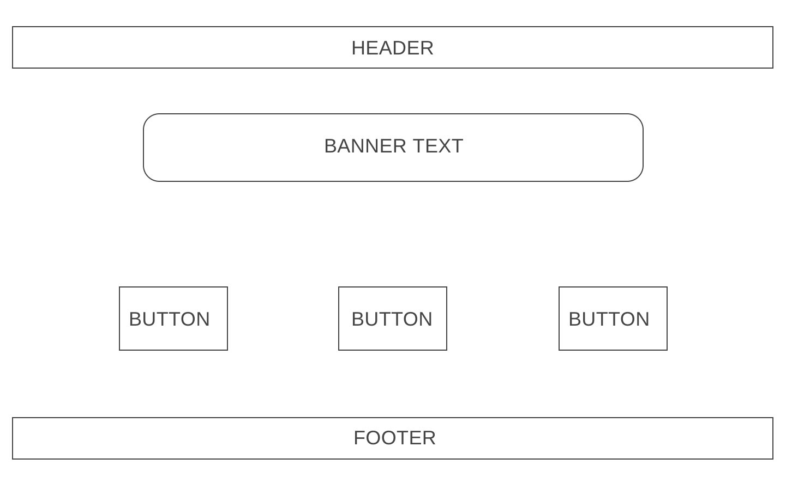
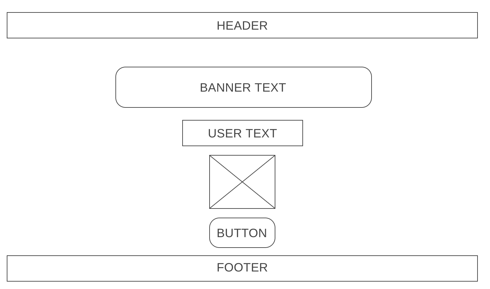
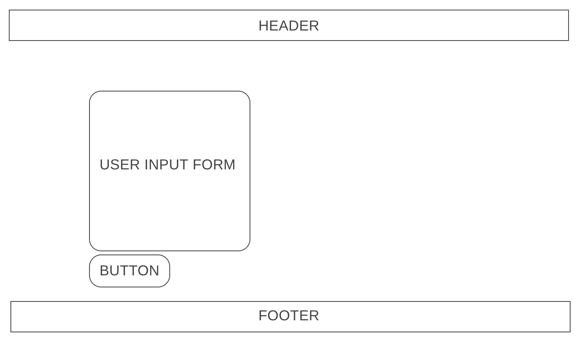
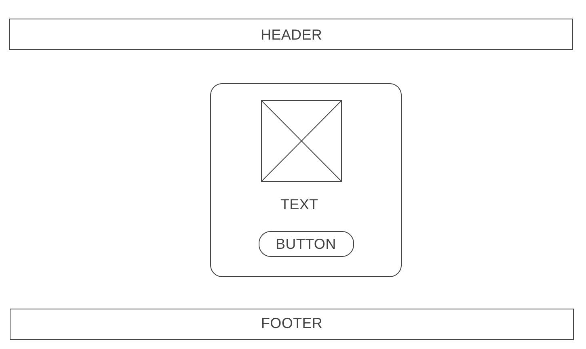
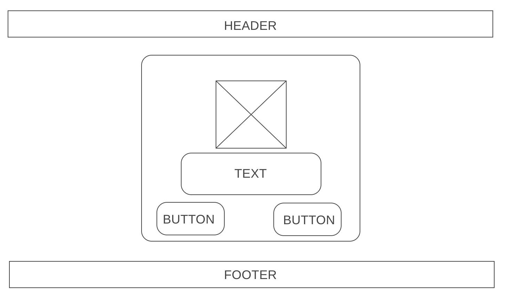
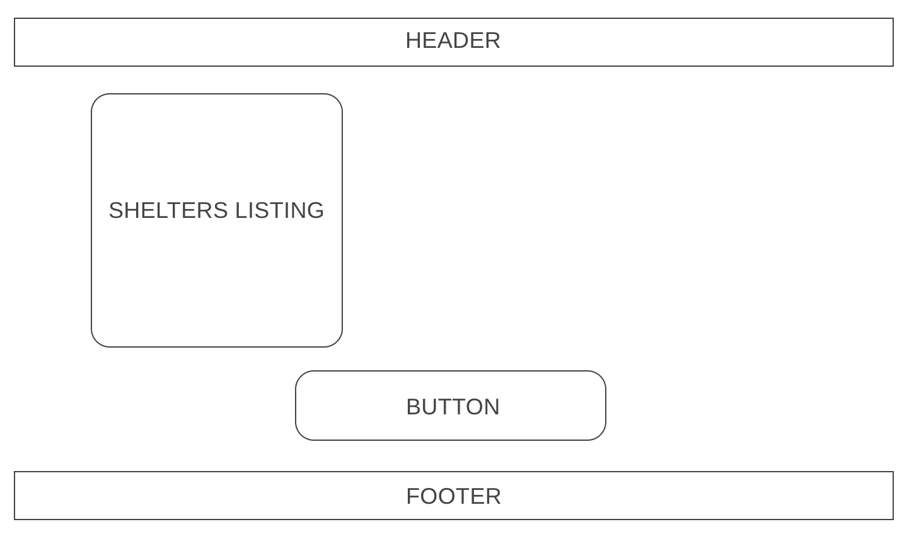
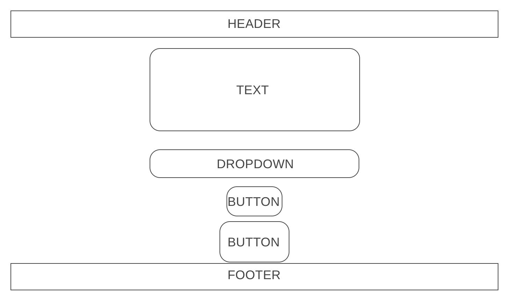

# Foster Finder

With this application you are able to view animals that are currently being fostered and are available for adoption. The user is able to view important information such as, breed, age, adoption fee, and the location of the animal.

[Deployed Heroku Site](https://rocky-sierra-50409.herokuapp.com/)

[Trello](https://trello.com/b/OZiwvSq2/foster-find)

## Foster Features:

* The user is able to add their name and view their user information.
* The user can also delete their account.
* In the application the user can view a dashboard that lists the fosters available for adoption.
* The user can view adoptable fosters in more detail on an individual page.
* The user can edit a fosters's information and remove the foster from the index page.
* The user can view a dashboard of shelters.
* The user can add a new shelter and delete a shelter from the list.
* The user can add a foster to a shelter if no association exists.

## Wireframe:

### Landing Page

### User Page

### User Form Page

### Foster Page Dashboard

### Individual Foster Page

### Shelter Page Dashboard

### Individual Shelter Page

### ERD

## Technologies:

* Languages - Javascript, HTML, and CSS
* Design - Google Fonts and Boostrap
* Visual Studio Code

## Features and Future Improvements:

#### Current Features

* Able to create, read, and delete user
* Able to create, edit, update, and delete fosters
* Able to create, read, and delete shelters
* Able to add a foster to a shelter via the specific shelter show page

___

#### Future Improvements:

* In Version 2 of this application I would like to soft-delete the animals and show them on a separate page that displays adoptions.

* I would like to have the user to add an animal as their favorite and have that animal display on their user page.

* I would like to create a message box under each animal and have users post inspirational messages.

## Credits

Background image photo by Josh Sorenson on Unsplash.